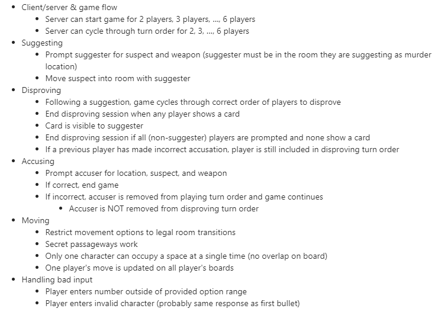

# Clueless Setup
## Setting up Virtual Environment for Clueless using Poetry

### Download Poetry for Mac

"pip3 install poetry" / "brew install poetry" (if you use homebrew)

### Setting up the Virtual Environment Mac

- poetry config virtualenvs.in-project true

- poetry install

- go to interpreter settings: add local interpreter 

  - select poetry environment

### Download Poetry for Windows

- Follow https://www.jetbrains.com/help/pycharm/poetry.html for poetry installation.

- poetry config virtualenvs.in-project true

- poetry install

- go to interpreter settings: add local interpreter
  - select base interpreter (python 3.11)
  - poetry executable found in link above

# TODO List
## Game Client

### TitleView

### GameView
- 2. Game Observation
  - When game starts, player view should change to observe game events even if it's not their turn
    - movement 
      - (OPTIONAL) add a message in action box to describe who moved and in what direction
    - suggestions
      - (REQUIRED) you should see who suggested + the suggestion

## SERVER
  - 3. (BUG-OPTIONAL) if everyone loses, then game should end and not crash

- Meeting QA
  - check on turn order + disprove order
  - limit number of connections to the server

QA: 
- Each player's cards are unique
- 

