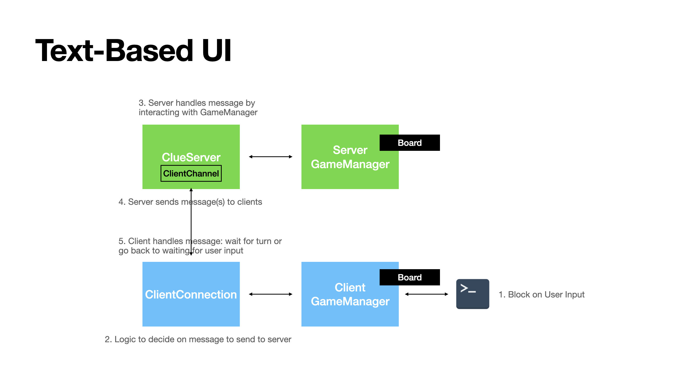
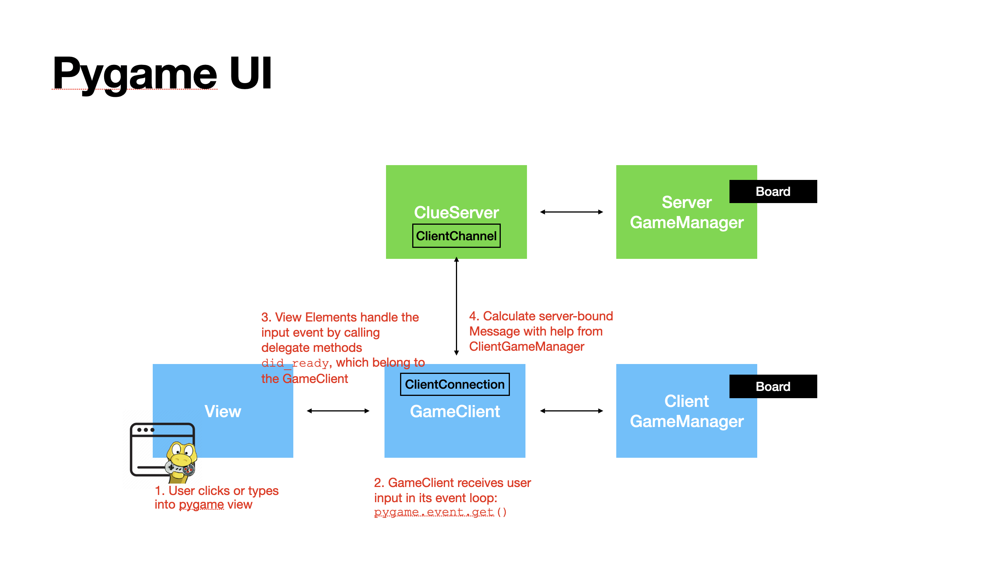
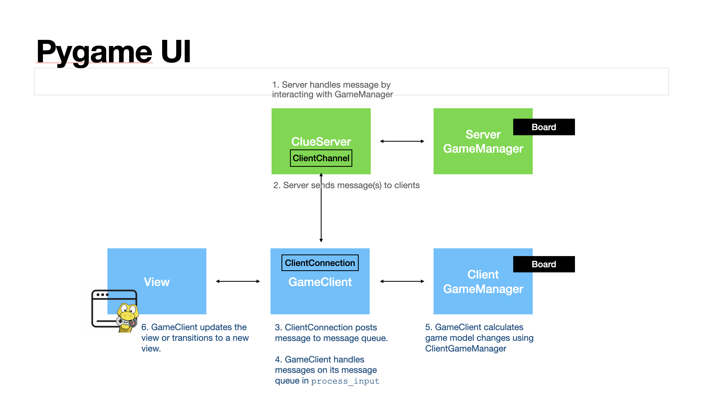

# App Architecture

In order to implement a pygame-based UI, I had to rearrange some of our existing client pieces. The main difference
between a text-based UI and a pygame-based UI is that we are switching from synchronous to asynchronous user input.
The text-based UI always blocks on user input to determine which message to send to the server.
A pygame-UI relies on asynchronous I/O events, so the main thread cannot be blocked. We must handle server 
messages alongside these I/O events too, since they can be interwoven.

The UI is also much more complex. The text-based UI prints results to command line and takes in inputs one 
at a time whereas pygame manages a window with multiple elements drawn in it that we have to add and remove. 

## Model-View-Controller (MVC) architecture
For a UI application, usually it is easier to split the code into model, view, and controller.
- Model: application/game logic, like board movement, board state, available turn calculations
- View: drawing the pygame window
- Controller: mediates between the model and the view and handles I/O and server messages

## Text-Based UI
In the text-based UI, the model is the client game manager. The controller is the client connection
that sends and receives messages to and from the server. The view is also within the client game manager. In order to
transition to pygame, we need to move the View logic into a separate class that the controller can interact with.

## Pygame-based UI
In the pygame-based UI, we moved the View into a separate class that handles all UI. We then removed all
command line printing and reading from the game manager. 

We also reduced the responsibilities of the client connection to only communicate with the server and introduced 
the game client to serve as the controller. The game client will now handle both I/O and server messages by updating the
View and the Model.

